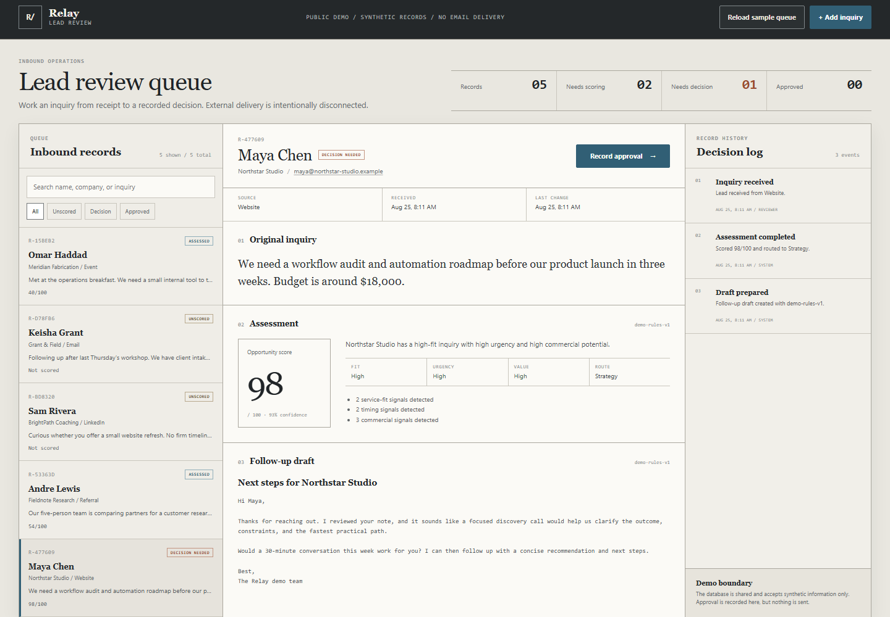
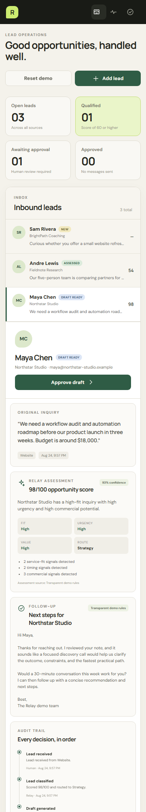
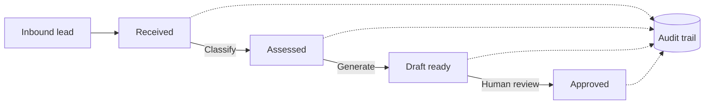

# Relay

[](https://github.com/SpacebaII/relay/actions/workflows/ci.yml)

**AI-assisted lead operations with an explicit human approval boundary.**

[View the live demo](https://relay-lead-ops.spacebaii-portfolio.workers.dev) · [Read the case study](docs/case-study.md) · [View v0.1.0](https://github.com/SpacebaII/relay/releases/tag/v0.1.0)

Relay turns an unstructured inquiry into a transparent opportunity assessment and a personalized follow-up draft. A person reviews the recommendation, approves the response, and can inspect the complete audit trail. The MVP never sends email.



<p align="center">
  
</p>

## Why it exists

Small agencies and consultancies often manage new business from disconnected forms and inboxes. Leads get inconsistent attention, response times stretch, and promising work can be missed. Relay explores a practical alternative: automate the repetitive interpretation and drafting work while keeping judgment and external actions with a human.

This repository is also a production-minded portfolio project. It demonstrates domain modeling, state transitions, persistence, model-provider isolation, structured AI output, auditability, automated testing, responsive UI work, CI, and serverless deployment.

## Features

- Capture inbound leads with validation and duplicate detection
- Assess fit, urgency, commercial value, and routing
- Explain every score with readable supporting signals
- Generate a personalized follow-up draft
- Require human approval before simulated handoff
- Preserve a chronological audit trail
- Seed a safe synthetic demo in one click
- Switch between deterministic demo intelligence and an optional OpenAI adapter
- Run locally and deploy on a zero-dollar Cloudflare baseline

## Product workflow



Transitions are enforced in the domain layer. A client cannot skip classification, approve a missing draft, or create the same lead twice.

## Architecture

Relay uses a single deployable Worker with clean internal boundaries:

```text
React UI → Worker HTTP API → RelayService → LeadRepository
                                  ↓              ↓
                         LeadIntelligence   Cloudflare D1
                           ↙          ↘
                     Demo rules    OpenAI adapter
```

- **Domain:** entities, validation, and legal workflow transitions
- **Application:** use-case orchestration through interfaces
- **Infrastructure:** D1 persistence and interchangeable intelligence providers
- **Interface:** responsive React application and Worker HTTP routes

The structure preserves testability and future migration paths without introducing separate services prematurely. See [ADR 0001](docs/architecture/0001-single-worker-clean-architecture.md) for the decision and tradeoffs.

## Tech stack

- TypeScript and React
- Vite with the Cloudflare plugin
- Cloudflare Workers and D1
- OpenAI Responses API with strict structured output (optional)
- Vitest and Playwright
- ESLint and GitHub Actions

## Local installation

Requirements: Node.js 22 or newer.

```bash
git clone https://github.com/SpacebaII/relay.git
cd relay
npm install
npm run db:local
npm run dev
```

Open `http://127.0.0.1:5173`, select **Reset demo**, and choose a sample lead. Local D1 state is stored under `.wrangler/` and is excluded from version control.

## Usage

1. Add an inquiry or load the synthetic sample set.
2. Select a new lead and choose **Classify lead**.
3. Review the score, confidence, routing, and reasons.
4. Choose **Generate draft** and inspect the response.
5. Choose **Approve draft** to record human approval.
6. Verify all four events in the audit trail.

Approval is intentionally a simulated handoff. Relay does not send an email or call any external CRM.

## Intelligence modes and cost controls

The checked-in configuration uses `AI_MODE=demo`. This mode is deterministic, makes no external requests, and costs nothing.

An OpenAI adapter is included for private evaluation. It:

- runs only in the Worker, never the browser;
- reads the API key from a Worker secret;
- uses strict JSON Schema output;
- disables response storage;
- caps each response at 700 output tokens;
- is never enabled by the public-demo configuration.

Do not enable live AI on an unauthenticated public deployment. See [deployment guidance](docs/deployment.md) for the safe setup.

## Quality checks

```bash
npm run check       # lint, types, coverage thresholds, production build
npm run test:e2e    # real browser against the local Worker and D1
npm run screenshots # refresh portfolio screenshots from synthetic data
```

Current coverage thresholds require at least 80% lines/functions/statements and 65% branches for the domain, application, and intelligence-provider layers.

## Project structure

```text
src/
  application/       use cases and ports
  domain/            business rules and entities
  App.tsx             React workflow interface
worker/
  index.ts            HTTP adapter
  d1-repository.ts    persistence adapter
  *-intelligence.ts   intelligence providers
tests/                unit and application integration tests
e2e/                  browser workflow tests
docs/                 product, architecture, deployment, and case-study evidence
```

## Deployment

Relay is live on Cloudflare Workers at [relay-lead-ops.spacebaii-portfolio.workers.dev](https://relay-lead-ops.spacebaii-portfolio.workers.dev). The public deployment uses D1 and deterministic demo intelligence. It requires no paid plan, custom domain, model key, or live model request. Follow [docs/deployment.md](docs/deployment.md) to reproduce the deployment.

## Roadmap

- Editable drafts with revision history
- Authenticated workspaces and role-based approval
- Configurable qualification rules
- Per-tenant model budgets and rate limits
- Email and CRM adapters behind explicit confirmation gates
- Evaluation datasets comparing rules and model-assisted classifications
- Conversion analytics and response-time reporting

## Engineering story

The [development journal](docs/development-journal.md) records decisions, defects, and visual iterations as they happened. The [case study](docs/case-study.md) turns that evidence into an interview-ready narrative.

## License

MIT
